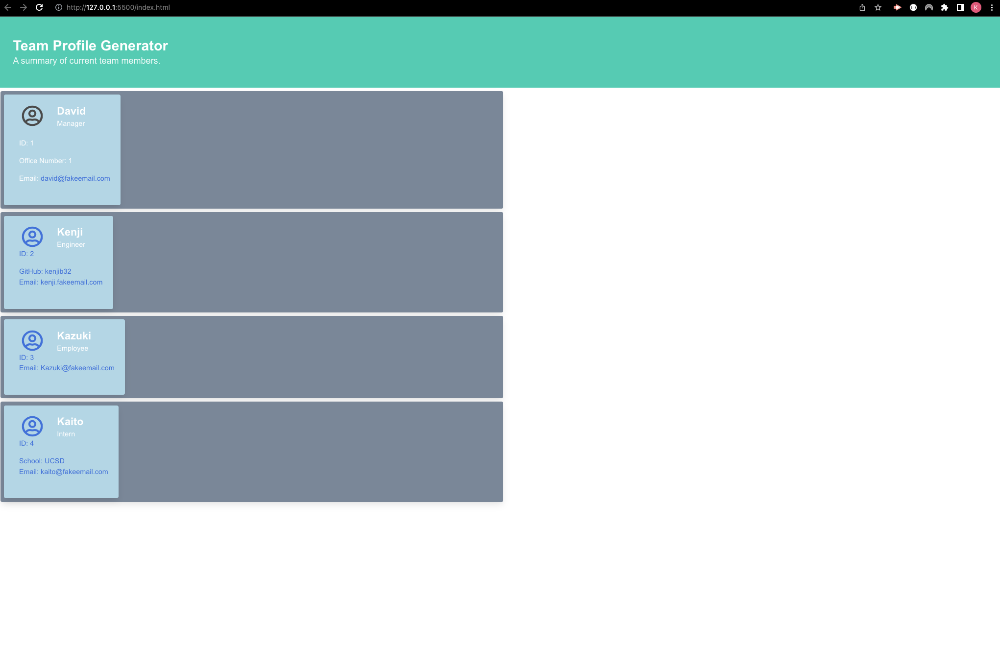

# Profile-Week-10-Challenge

Module 10 Challenge

## Description

Creating a daily planner/scheduler application where users can save any information to jot down their scheduled activities on their designated timeframe. 
## Link

<https://kenjib32.github.io/Profile-Week-10-Challenge/>
## Walkthrough

Walkthrough Video Link <https://github.com/Kenjib32/Profile-Week-10-Challenge/tree/main/Images/demo>

## Complied Criteria

* HTML file is generated that displays Team Profile.

* Default email program opens and populates the TO field including the email address on the address bar when the team member's email has been clicked.

* Prompted to enter team members' (manager, engineer, employee, and intern) employee ID, email address, office number, and school.

* After finishing the entry, an option to add a staff member will appear.

* Option to finish the entries once finished, and the HTML will be generated.

## Repository

<https://github.com/Kenjib32/Profile-Week-10-Challenge>